<p align="center">
  <picture>
    <source media="(prefers-color-scheme: dark)" srcset="docs/design/logo/svg/verso-logotype-sombre.svg">
    
  </picture>
</p>

<p align="center"><strong>J’ouvre l’app, je suis exactement où j’étais, et le texte est agréable à lire.</strong></p>

Verso est un lecteur d’EPUB pour Android, minimaliste et entièrement hors ligne. Il distingue la position que vous **lisez** de celle que vous **regardez** : un scroll accidentel ne fait jamais perdre votre page.

<p align="center">
  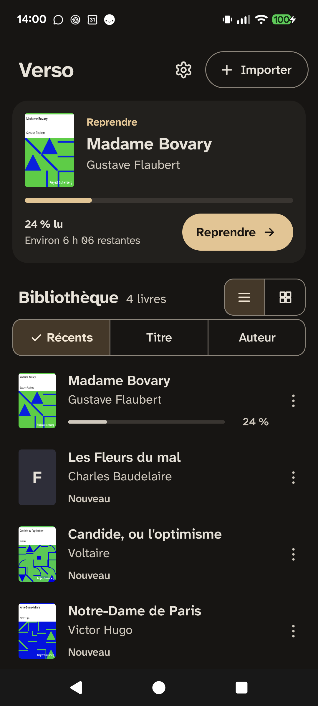
  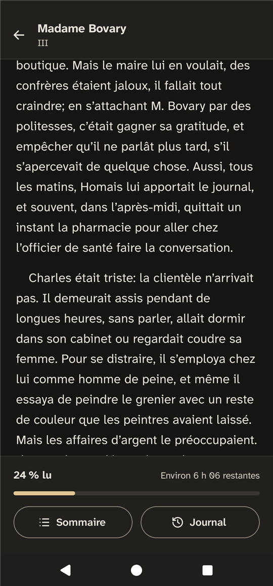
  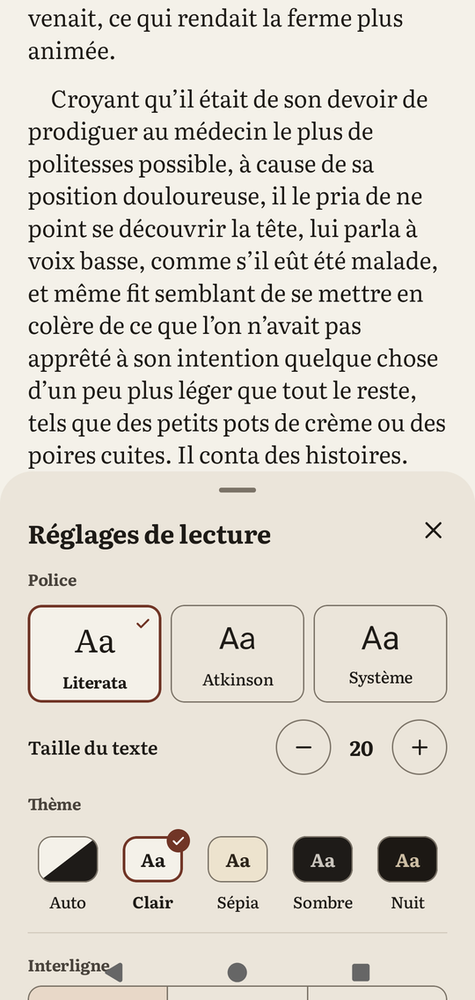
  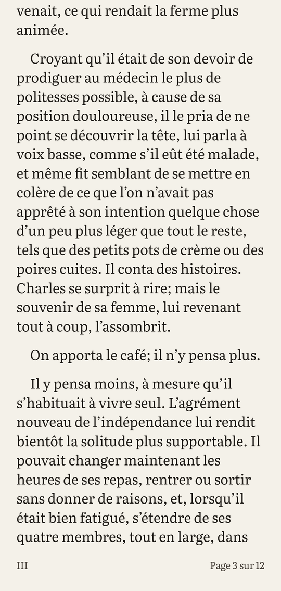
  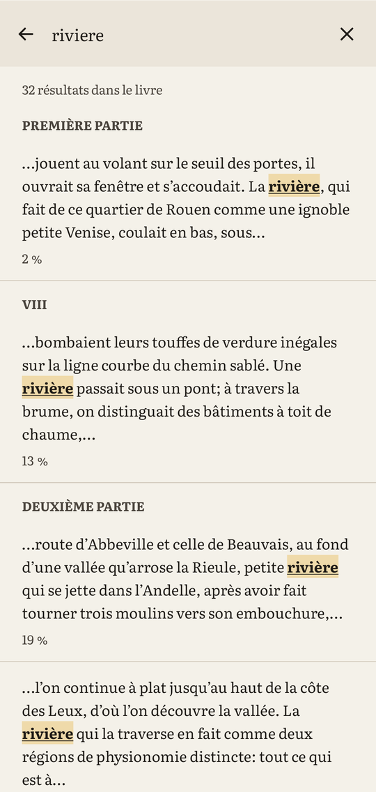
  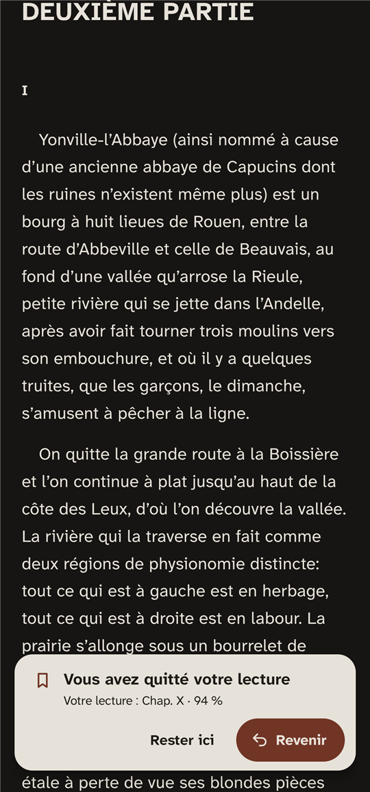
  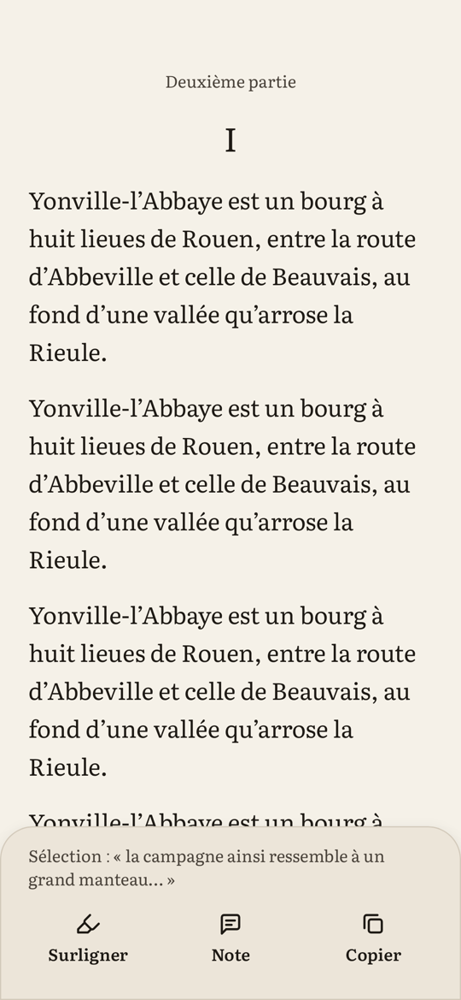
  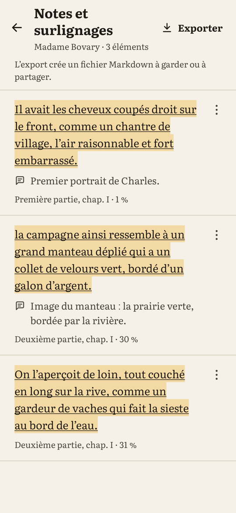
  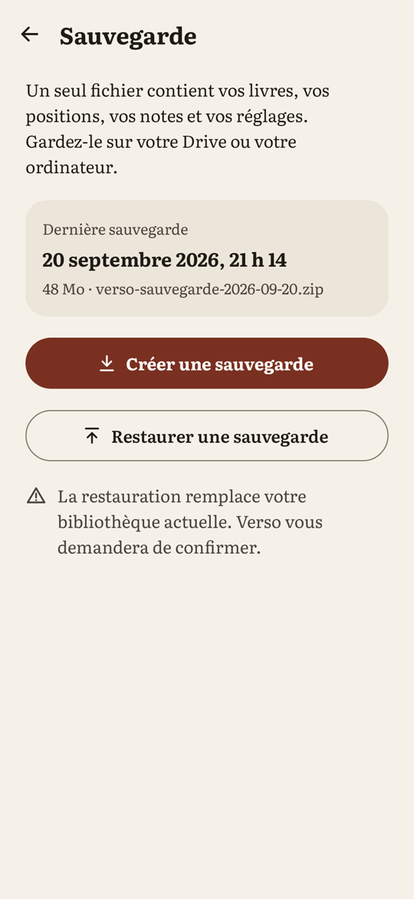
  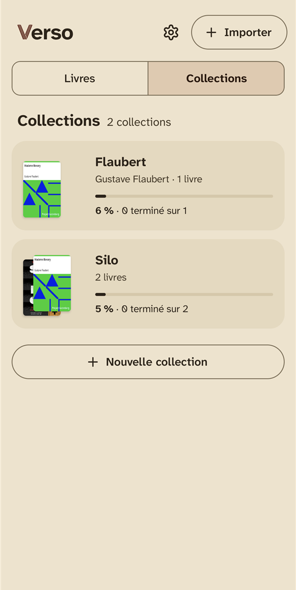
  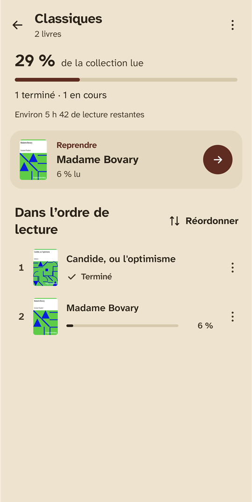
</p>

## Ce que fait Verso

- **Import sans friction** : sélecteur de fichiers Android (téléphone, Drive, Nextcloud) ou « Ouvrir avec Verso » depuis n’importe quelle application ; doublons détectés par empreinte SHA-256, fichiers non EPUB et DRM refusés proprement.
- **Bibliothèque** en liste ou en grille, triée par récents, titre ou auteur, filtrée par état, avec une carte « Reprendre » qui montre l’extrait où vous vous êtes arrêté et le temps restant.
- **Lecture confortable**, réglée d’après la recherche : Literata par défaut (Atkinson Hyperlegible Next ou la police du téléphone au choix, dans toute l’app), taille, interligne et marges réglables en direct, aligné à gauche sans césure, thèmes Clair, Sépia, Sombre et Nuit, en scroll continu ou en pages, mémorisé par livre.
- **Une progression qui ne se perd pas** : un fling, un grand saut ou un passage par le sommaire ne déplacent pas la position de lecture ; une carte « Revenir » vous y ramène en un tap.
- **Journal de lecture** : chaque session avec ses heures, sa durée, le passage lu et « Reprendre ici ».
- **Surlignages et notes** : un appui long ouvre une barre « Surligner, Note, Copier » ; les passages qui se recoupent fusionnent, notes gardées ; « Notes et surlignages » les liste dans l’ordre du livre et les exporte en Markdown, groupés par chapitre. Sélectionner ne déplace jamais la position de lecture.
- **Sauvegarde** : un seul fichier zip (livres, positions, journal, notes, réglages) enregistré où vous voulez, et une restauration qui vérifie tout avant de remplacer quoi que ce soit, tout ou rien.
- **Collections** : regroupez une série dans l’ordre de lecture, suivez sa progression pondérée par la longueur des livres et le temps restant, reprenez au premier livre non terminé ; un livre peut appartenir à plusieurs collections.
- **États et statistiques** : livres à lire, en cours ou terminés, filtres et tri ; temps de lecture, vitesse moyenne et temps restant à votre rythme.
- **Recherche plein texte** : résultats au fil de la recherche, groupés par chapitre, mot marqué par un fond, du gras et un soulignement, carte « Revenir » après le saut.
- **Accessible** : contraste d’au moins 7:1, commandes de 48 dp, texte à 200 % sans coupure, intitulés TalkBack.
- **Privé** : aucune permission, pas d’Internet, pas d’analytics. Rien ne quitte le téléphone.

## Stack

Kotlin 2.4 · Jetpack Compose (Material 3) · Navigation Compose · Readium Kotlin Toolkit 3.4 · Room · DataStore · Coil · JUnit, Truth, Turbine, Robolectric, Roborazzi · GitHub Actions.

## Architecture

- `:core`, Kotlin pur sans Android : la machine à états « lecture ou navigation » et la carte « Revenir », le suivi des sessions, les réglages de lecture, l’état d’un livre, les statistiques, les extraits de recherche, la fusion des surlignages, l’export Markdown, la validation d’une sauvegarde, la progression des collections et les calculs (temps restant, libellés, pages), testés en JUnit.
- `:app`, une seule activité Compose, MVVM, injection manuelle par `AppContainer`.
- Readium ouvre et affiche les EPUB derrière l’interface `ReaderController`, qui isole le moteur du reste de l’app.
- La position est un *locator* Readium (chapitre, progression, extrait), jamais des pixels : elle survit à un changement de taille de texte.
- Room garde livres, positions, sessions, surlignages et collections ; DataStore les préférences ; la sauvegarde est un zip avec les données en JSON, pas une copie de la base ; tous les seuils sont des constantes nommées.
- 1 225 tests (JUnit, Robolectric, Roborazzi) couvrent la machine à états, le suivi des sessions, la recherche, les surlignages, les collections, la sauvegarde et la restauration (fichiers abîmés, échec en plein remplacement) et les écrans clés, dans les cinq thèmes et à 200 %.

La spécification complète, avec les décisions et les critères d’acceptation, est dans [`docs/SPEC.md`](docs/SPEC.md).

## Compiler

Prérequis : JDK 17 et le SDK Android avec la plateforme `android-37`.

```bash
git clone https://github.com/MaximeBier/Verso.git
cd Verso
echo "sdk.dir=/chemin/vers/Android/Sdk" > local.properties
./gradlew :core:test :app:testDebugUnitTest   # tests
./gradlew :app:assembleDebug                  # APK dans app/build/outputs/apk/debug/
./gradlew :app:installDebug                   # installation sur un téléphone branché
```

## Licence

Code sous licence [Apache 2.0](LICENSE). Readium est sous licence BSD à 3 clauses, les polices Literata et Atkinson Hyperlegible Next sous SIL Open Font License 1.1 ; la liste complète est dans l’écran « Licences open source » de l’application.
