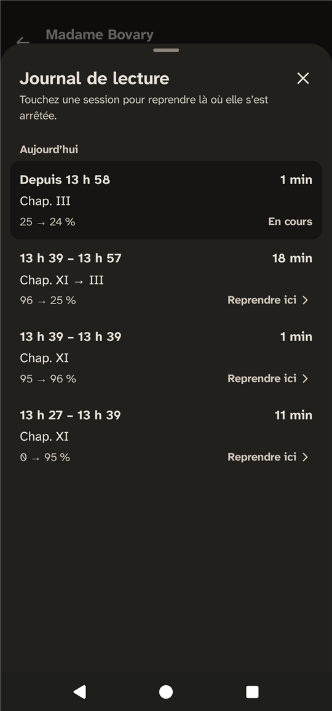

<p align="center">
  <picture>
    <source media="(prefers-color-scheme: dark)" srcset="docs/design/logo/svg/verso-logotype-sombre.svg">
    
  </picture>
</p>

<p align="center"><strong>J’ouvre l’app, je suis exactement où j’étais, et le texte est agréable à lire.</strong></p>

Verso est un lecteur d’EPUB pour Android, minimaliste et entièrement hors ligne. Il distingue la position que vous **lisez** de celle que vous **regardez** : un scroll accidentel ne fait jamais perdre votre page.

<p align="center">
  
  
  
  
</p>

## Ce que fait la V1

- **Import sans friction** : sélecteur de fichiers Android (téléphone, Drive, Nextcloud) ou « Ouvrir avec Verso » depuis n’importe quelle application ; doublons détectés par empreinte SHA-256, fichiers non EPUB et DRM refusés proprement.
- **Bibliothèque** en liste ou en grille, triée par récents, titre ou auteur, avec une carte « Reprendre » qui montre l’extrait où vous vous êtes arrêté et le temps restant.
- **Lecture en scroll continu**, réglée d’après la recherche sur le confort de lecture : Atkinson Hyperlegible Next 19 sp, interligne 1,6, aligné à gauche sans césure, thème clair ou sombre selon le téléphone.
- **Une progression qui ne se perd pas** : un fling, un grand saut ou un passage par le sommaire ne déplacent pas la position de lecture ; une carte « Revenir » vous y ramène en un tap.
- **Journal de lecture** : chaque session avec ses heures, sa durée, le passage lu et « Reprendre ici ».
- **Accessible** : contraste d’au moins 7:1, commandes de 48 dp, texte à 200 % sans coupure, intitulés TalkBack.
- **Privé** : aucune permission, pas d’Internet, pas d’analytics. Rien ne quitte le téléphone.

## Stack

Kotlin 2.4 · Jetpack Compose (Material 3) · Navigation Compose · Readium Kotlin Toolkit 3.4 · Room · DataStore · Coil · JUnit, Truth, Turbine, Robolectric, Roborazzi · GitHub Actions.

## Architecture

- `:core`, Kotlin pur sans Android : la machine à états « lecture ou navigation » et la carte « Revenir », le suivi des sessions, les calculs (temps restant, libellés), testés en JUnit.
- `:app`, une seule activité Compose, MVVM, injection manuelle par `AppContainer`.
- Readium ouvre et affiche les EPUB derrière l’interface `ReaderController`, qui isole le moteur du reste de l’app.
- La position est un *locator* Readium (chapitre, progression, extrait), jamais des pixels : elle survit à un changement de taille de texte.
- Room garde livres, positions et sessions ; DataStore les préférences ; tous les seuils sont des constantes nommées.
- 544 tests (JUnit, Robolectric, Roborazzi) couvrent la machine à états, le suivi des sessions et les écrans clés, en clair comme en sombre.

La spécification complète, avec les décisions et les critères d’acceptation, est dans [`docs/SPEC.md`](docs/SPEC.md).

## Compiler

Prérequis : JDK 17 et le SDK Android avec la plateforme `android-37`.

```bash
git clone https://github.com/MaximeBier/Verso.git
cd Verso
echo "sdk.dir=/chemin/vers/Android/Sdk" > local.properties
./gradlew :core:test :app:testDebugUnitTest   # tests
./gradlew :app:assembleDebug                  # APK dans app/build/outputs/apk/debug/
./gradlew :app:installDebug                   # installation sur un téléphone branché
```

## Licence

Code sous licence [Apache 2.0](LICENSE). Readium est sous licence BSD à 3 clauses, la police Atkinson Hyperlegible Next sous SIL Open Font License 1.1 ; la liste complète est dans l’écran « Licences open source » de l’application.
